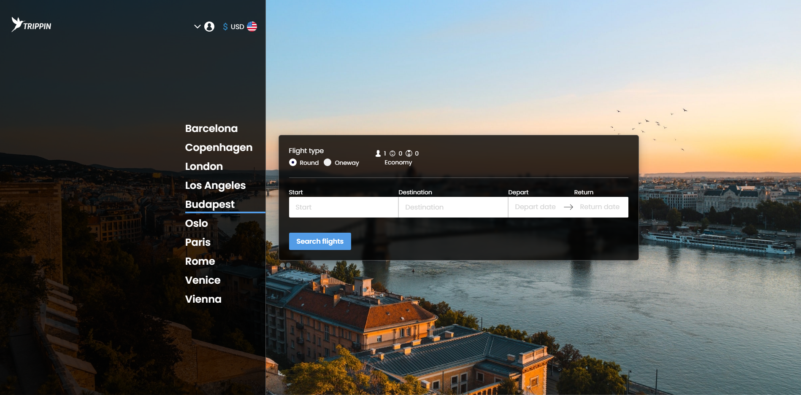

# Trippin - [**demo**](https://trippinproject.vercel.app/)

Trippin is a web application that lets you search for flights all around the world using kiwi.com API.

# General information

- It will always try to search for the cheapest routes available.
- It allows user to filter, sort and paginate through received flights.
- It suggests user trending destinations based on current starting location.
- If a user is logged in it allows him to save individual flights to the favourites list which he can find in menu. All the data is stored in firestore database.
- The app gives a user an option to choose language and currency.
- It supports guest mode
- Responsive

## APIs used

- tequila by kiwi.com Search API
- tequila by kiwi.com Locations API
- unsplash API
- flagpedia API

# Main frameworks/libraries used

- React v17 + TypeScript
- styled-components
- React Context API + useReducer
- React Router
- React Query
- Formik
- Firebase
- Downshift
- i18next
- react-toastify

## Testing

- Jest
- React testing library
- msw

# Screenshots/GIFs

### 1. Entry view

### 2. Main view

### 3. Results

### 4. Flight details

### 5. Favourites list

### 6. Menu view and settings modal

|                   Menu                   |                   Settings                    |
| :--------------------------------------: | :-------------------------------------------: |
|  |  |

# 7. Installation

In order to install use `npm install` in terminal.  
Afterwards use `npm start` to run the app locally.

#### Notes:

- if encountered problems with `npm install` try using `npm install --force` since react-dates might be causing problems with react v17+
- you would need api keys to fully setup application
